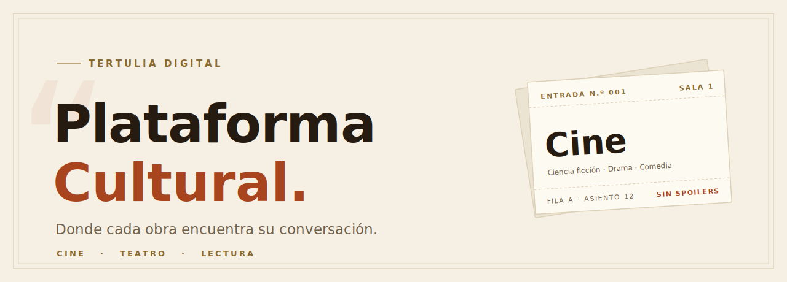

<!-- ════════════════════════════════════════════════════════════════════
     PLATAFORMA CULTURAL · README editorial — sistema de diseño "Tertulia"
     Los SVG del hero viven en .github/assets/ (versión clara y oscura).
     ════════════════════════════════════════════════════════════════════ -->

<div align="center">

<picture>
  <source media="(prefers-color-scheme: dark)" srcset=".github/assets/hero-dark.svg" />
  
</picture>

<br /><br />

[](https://nextjs.org)
[](https://react.dev)
[](https://www.typescriptlang.org)
[](https://tailwindcss.com)
[](https://firebase.google.com)
[](https://vitest.dev)

<br />


</div>

<br />

> *Reúne a personas dispersas con intereses culturales afines —* **cine, teatro y lectura** *— agrupándolas por subgénero, perspectiva de análisis y nivel de conocimiento. Sin el ruido de las redes generales. Sin spoilers que arruinen la obra.*

<div align="center"><sub>✦ &nbsp; ✦ &nbsp; ✦</sub></div>

## La cartelera

<table>
<tr>
<td width="33%" valign="top">

#### `N.º 01` · Cine
De la ciencia ficción al documental.
<br /><br />
<sub>**CIENCIA FICCIÓN · DRAMA · COMEDIA · DOCUMENTAL · ANIMACIÓN**</sub>

</td>
<td width="33%" valign="top">

#### `N.º 02` · Teatro
Del clásico al experimental.
<br /><br />
<sub>**CLÁSICO · CONTEMPORÁNEO · MUSICAL · EXPERIMENTAL**</sub>

</td>
<td width="33%" valign="top">

#### `N.º 03` · Lectura
De la novela al ensayo.
<br /><br />
<sub>**NOVELA · ENSAYO · POESÍA · CUENTO · NO FICCIÓN**</sub>

</td>
</tr>
</table>

> Cada subgénero es una **comunidad**: descubre miembros afines y abre discusiones sobre obras. El contenido marcado como spoiler se oculta hasta que decides revelarlo.

<div align="center"><sub>✦ &nbsp; ✦ &nbsp; ✦</sub></div>

## La función comienza así

1. **Crea tu perfil cultural** — elige intereses y declara tu nivel: de quien apenas empieza a quien domina la materia.
2. **Afina tu lente** — marca subgéneros y pondera tus perspectivas: trama, técnica, actuación, reflexión filosófica o contexto histórico.
3. **Únete a la tertulia** — conversa a fondo con personas afines aunque estén lejos, en comunidades por subgénero.

<div align="center"><sub>✦ &nbsp; ✦ &nbsp; ✦</sub></div>

## Entre bastidores

Arquitectura **feature-based** con flujo de dependencias en un solo sentido:

```
page  →  componente  →  hook  →  service  →  Firebase SDK
                                       ↘  constants · types
```

<sub>**TypeScript strict** · cero strings hardcodeados · cero números mágicos · los componentes nunca llaman al SDK de Firestore directo · `Timestamp` jamás cruza fuera de la capa de servicios. Detalle completo en [`.claude/Project-context.md`](.claude/Project-context.md).</sub>

| Capa | Pieza |
|------|-------|
| **App Router** | `auth` · `profile` · `communities` · landing · 404 / error |
| **Features** | `auth` · `profile` · `communities` — cada una con `components / hooks / services / types / constants` |
| **Backend** | Firestore + Firebase Auth, autorización en [`firestore.rules`](firestore.rules) (testeadas en CI) |
| **Estado** | React Context — `AuthProvider` · `ToastProvider` |

<div align="center"><sub>✦ &nbsp; ✦ &nbsp; ✦</sub></div>

## Levantar el telón

```bash
pnpm install
cp .env.example .env.local    # rellena tu configuración de Firebase
pnpm dev                      # http://localhost:3000
```

```bash
pnpm seed                     # carga el catálogo (intereses · subgéneros · perspectivas)
```

> Requisitos: **Node 20+**, **pnpm 10+**. Las claves `NEXT_PUBLIC_FIREBASE_*` son públicas por diseño; la seguridad real vive en las Security Rules. La service account (`KEY DE PROYECTO ADMIN 3.json`) y `.env.local` **nunca** se versionan.

<details>
<summary><b>&nbsp;Telón de comandos</b></summary>

<br />

| Comando | Función |
|---------|---------|
| `pnpm dev` | Servidor de desarrollo |
| `pnpm build` · `pnpm start` | Build de producción y arranque |
| `pnpm lint` · `pnpm typecheck` | ESLint y chequeo de tipos |
| `pnpm test` · `pnpm test:coverage` | Pruebas unitarias (+ cobertura) |
| `pnpm test:rules` | Security Rules contra el emulador de Firestore |
| `pnpm format` | Prettier |
| `pnpm seed` | Carga del catálogo (Admin SDK) |
| `firebase emulators:start` | Auth (9099) + Firestore (8181) |
| `firebase deploy --only firestore` | Despliegue de rules e índices |

**CI/CD** — [`ci.yml`](.github/workflows/ci.yml) corre lint · typecheck · test · build · rules en cada push/PR; [`deploy.yml`](.github/workflows/deploy.yml) despliega a Vercel tras un CI verde en `main`.

</details>

<br />

<div align="center">

<sub>**PLATAFORMA CULTURAL**</sub><br />
<sub>*Cine · Teatro · Lectura*</sub><br /><br />
<sub>Proyecto del curso Administración de Proyectos · Grupo 51 · I Semestre 2026</sub>

</div>
